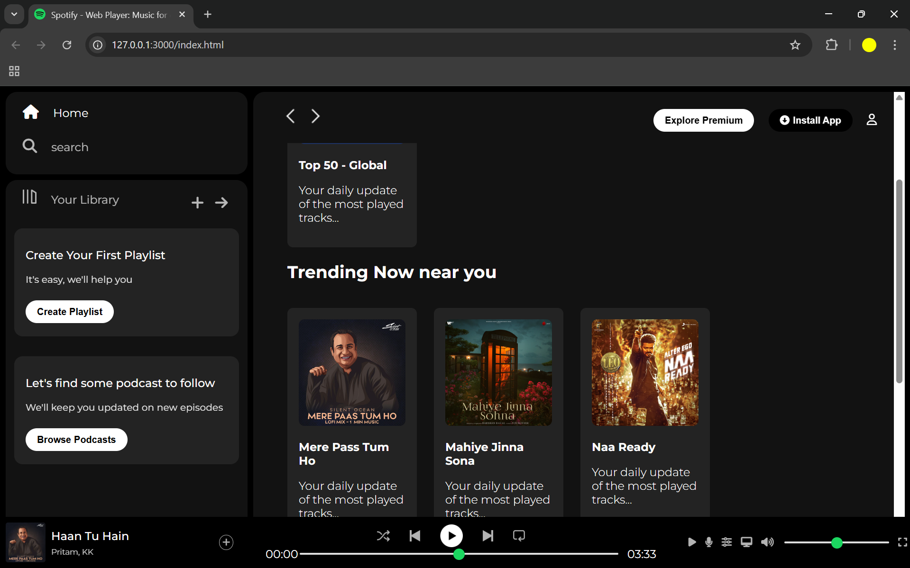

# 🎧 Spotify Clone

A simple and clean **frontend clone of Spotify**, built using **HTML5** and **CSS3**.  
This project replicates the layout and design of the Spotify landing page/interface for learning and portfolio purposes.

## 🔗 Live Demo
👉 [View the Live Site](https://rishiadhikary.github.io/spotify-clone/)

## 📂 Features
- Responsive music-themed UI
- Pure HTML & CSS (no frameworks)
- Practice of Flexbox, Grid, and positioning
- Clean structure for beginners

## 🛠️ Technologies Used
- HTML5
- CSS3

## 📸 Screenshot

```md

